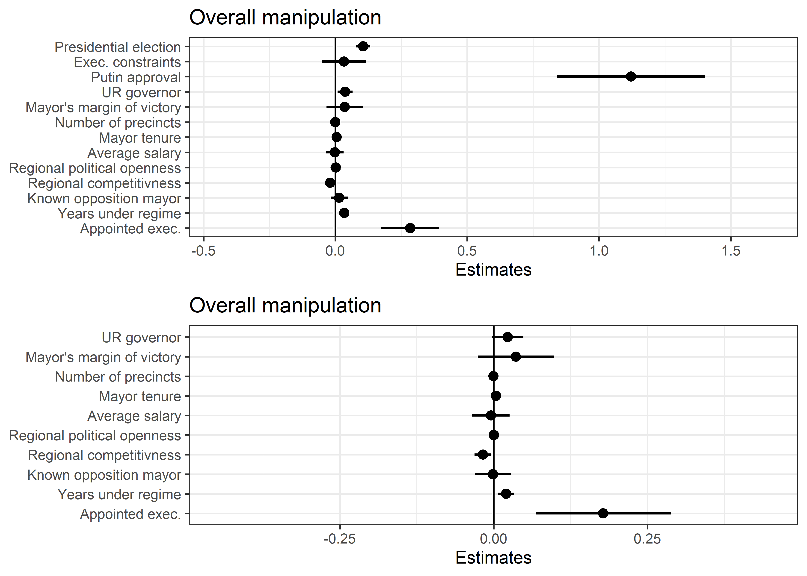

# reproducibility 

```{r setup2, echo=FALSE, warning = FALSE, message = FALSE}
knitr::opts_chunk$set(warning = FALSE, message = FALSE, echo = FALSE)
library(tidyverse) 
library(readxl)
library(here)
library(ggplot2)
library(fs)
library(DT)
```

Making sure that research is reproducible, is an important measure to avoid fraud and generating results based on the general interest of a person or company. A big step towards making research reproducible is the movement towards open science, where the methods of both research and the data analysis are shared. In my opinion, open research helps to speed up progression and holds potential to decrease fraud. Therefor, I support the movement towards open science. In this chapter, I will review 2 papers, to show that I am able to determine how open the researchers are about their methods for both the laboratory work and the data analysis. 

The first paper will be a more 'traditional' research paper, and is found on [pubmed](https://pubmed.ncbi.nlm.nih.gov/). This paper will be reviewed based upon following  ‘Repita’ criteria, as shown in figure \@ref(fig:table2). 

The second paper, will be a r code paper, and is found on the [OSF website](https://osf.io/). The review of this paper will focus more heavily on the readability and reproducibility of the r code and will be less centered around the criteria shown in figure \@ref(fig:02table1)

```{r 02table1, fig.cap="table with repita criteria for reviewing articles"}
datatable(read_excel(here("raw/table_assignment1.2.xlsx")))
```

## paper1
The following article will be reviewed: @ahmedFivedayCourseIvermectin2021

this study involved 72 patients from Dhaka, Bangladesh (criteria were age 18–65 years;admitted to hospital within the last 7 days; presence of a fever (≥37.5 °C), cough, and/or sore throat; diagnosed positive for SARS-CoV-2)

the patients were seperated into 3 groups: 
- oral ivermectin alone (12 mg once daily for 5 days)
- oral ivermectin in combination with doxycycline (12 mg ivermectin single dose and 200 mg doxycycline on day 1, followed by 100 mg every 12 h for the next 4 days)
- a placebo control group. 

The primary endpoints that were measured were the time required for virological clearance, and the remission of fever (≥37.5 °C) and cough within 7 days. 

in conclusion, the study found that Virological clearance was earlier in the 5-day ivermectin treatment arm when compared to the placebo group (9.7 days vs 12.7 days; p = 0.02). However, the virological clearance was not lower for the ivermectin + doxycycline arm (11.5 days; p = 0.27). There were no severe adverse drug events recorded in the study. A 5-day course of ivermectin was found to be safe and effective in treating adult patients with mild COVID-19. Larger trials, however, would still be needed to confirm these preliminary findings.

### study purpose: 
the study purpose was clearly destribed in the introduction: 
The study was performed to evaluate the rapidity of viral clearance and safety of a 5-day course of ivermectin or a single-dose of ivermectin and a 5-day course of doxycycline in the treatment of mild COVID-19 in adults.

### data availibality/location: 
there was no data availability statement found, neither was the (raw) data found anywhere linked by the article. 

### study location: 
the study location, and origin of the patients has been given. The criteria which had to be met for patients to take place in the research has also been listed. 

### author review: 
proper information of how to contact the authors has been provided. 

### ethics statement: 
there is an ethics statement in the study, for aproval of the experimental setup by both medical institutes and the patients. However, no further mention has been made of ethics regarding the experimental data. 

### funding statement: 
A funding statement was provided, the study was funded by Beximco Pharmaceutical Limited, Bangladesh. 

### code availability: 
no mention of code has been made. 

### conclusion: 
in conclusion: this paper has properly described their findings, sources and conclusions. However, the raw/processed data is not available nor is the code with which the data was analysed. Therefor, this paper is not entirely open science and can still improve, by providing the data and the used code to analyse the data. 


## paper2 

the second article that will be reviewed is: @harveyWhoDeliversVotes2022

multiparty elections provide a variety of benefits for regime survival. Specifically,  the introduction of local elections in otherwise closed regimes has been shown to generate improvements in government legitimacy and performance. However, some non-democratic governments do not hold local executive elections, with the hopes of increasing control over local political resources. 

In this paper, is tested if appointed local executives in Russian voting  will produce more election manipulation for national parties and if this comes at a cost to the party’s un-manipulated support. 
To test this theory, the study will use an election-forensic analysis of precinct-level election data from 176 Russian cities over six national elections from 2003 to 2012. 

this paper proposes that appointed local executives will produce more election manipulation for national parties, but that this comes at a cost to the party’s un-manipulated support. 

### analysing the code 

the provided  r code appears to have a few goals: 
- making the data tidy (removing na, proper row/colum orginisation for the data analysis, etc.)
- visualizing and interpreting the data 
- creating marginal structural models to account for selection bias and confounding.

The code has a good readability. It is properly spaced out, and lines of code are provided with comments to explain the code. However, not all code lines have comments. This makes some of the code, sightly harder to read. Therefor, in terms of readability, I rate the code of this paper a 4 out of 5. 

After downloading and running the code, I hardly had to make any changes at all to let the code run. The only changes that were required, were: 
- installing the packages I didnt have yet with the install.package() function. 
- specify where I stored the data files on my computer

With the provided code, I was also easily able to recreate the images that were in the original paper. An example of this, is shown in figure \@ref(fig:02graph1). This was figure2 in the original paper. In this figure, it is visible that putin has a far higher manipulation than the other politisians ands that appointed exec party also has sightly higher manipulation. Because it was so easy to run the code, and recreate the same figures, the reproducibility of this code gets a 5 out of 5. The used code is further shown down bellow figure \@ref(fig:02graph1). 

```{r 02graph1, fig.cap="recreated graph from reviewed paper"}

```

### raw code of paper 2 

```{r, eval=FALSE, echo=TRUE}
library(tidyverse)
library(interactions)
library(stargazer)
library(fastDummies)

full.data <- read.csv("raw/coefs with city covariates cleaned.csv")
precincts_total <- read.csv("raw/n_precincts_all.csv")


full.data <- full.data %>% mutate(presidential = ifelse(year.x == 2004 | year.x == 2008 | year.x == 2012, 1, 0))
full.data <- full.data %>% mutate(known.opp.mayor = ifelse(is.na(opp_mayor1) == T, 0, ifelse(opp_mayor1==1, 1,0)))
full.data <- full.data %>% mutate(appointed.exec = ifelse(is.na(cancel.year)==T, 0, ifelse(year.x >= cancel.year, 1, 0)))
full.data <- full.data %>% dplyr::rename(turnout.coef = turnout)

full.data <- full.data %>% mutate(years.with.elections = ifelse(is.na(cancel.year)==T, year.x-1996, ifelse(year.x - cancel.year < 0, year.x - 1996, cancel.year - 1996))) #This gives a measure of early vs late vs. control; 1996 bc this is when local elections first took place 

full.data <- full.data %>% mutate(years.post.treatment = ifelse(is.na(cancel.year)==T, 0, ifelse(year.x - cancel.year < 0, 0, year.x - cancel.year)))
full.data <- full.data %>% mutate(years.post.treatment = ifelse(is.na(cancel.year)==F & cancel.year == 2007 & year.x ==2007, 1, years.post.treatment)) #This codes cancelations in 2007 and 2011 as 1 for those years, since elections take place at year-end.
full.data <- full.data %>% mutate(years.post.treatment = ifelse(is.na(cancel.year)==F & cancel.year == 2011 & year.x ==2011, 1, years.post.treatment)) #This codes cancelations in 2007 and 2011 as 1 for those years, since elections take place at year-end.

full.data <- full.data %>% mutate(treated.post.treatment = ifelse(is.na(cancel.year)==T, 0, ifelse(year.x - cancel.year < 0, 0, 1)))
full.data <- full.data %>% mutate(treated.post.treatment = ifelse(is.na(cancel.year)==F & cancel.year == 2007 & year.x ==2007, 1, treated.post.treatment)) #This codes cancelations in 2007 and 2011 as 1 for those years, since elections take place at year-end.
full.data <- full.data %>% mutate(treated.post.treatment = ifelse(is.na(cancel.year)==F & cancel.year == 2011 & year.x ==2011, 1, treated.post.treatment)) #This codes cancelations in 2007 and 2011 as 1 for those years, since elections take place at year-end.


full.data <- full.data %>% mutate(years.under.appt = ifelse(is.na(cancel.year) == T, 0, ifelse(year.x - cancel.year < 0, 0, ifelse(year.x == 2007 | year.x == 2011 & year.x == cancel.year, 1, year.x - cancel.year))))

full.data <- full.data %>% mutate(city_id_factor = as.factor(city_id))


full.data <- full.data %>% mutate(treatment.group = ifelse(is.na(cancel.year)==F, 1, 0))

full.data <- full.data %>% mutate(control = ifelse(is.na(cancel.year)==T, 1, 0))
full.data <- full.data %>% mutate(early.treated = ifelse(is.na(cancel.year)==F & cancel.year <= 2007, 1, 0))
full.data <- full.data %>% mutate(late.treated = ifelse(is.na(cancel.year)==F & cancel.year > 2007, 1, 0))


full.data <- full.data %>% mutate(years.under.regime = ifelse(appointed.exec == 0, year.x - 2000, year.x - cancel.year))

##Dummies for ethnic categorical

full.data <- dummy_cols(full.data, select_columns = "ethnic.categorical")
full.data <- full.data %>% dplyr::rename(majority.russian.republic = ethnic.categorical_Majority_Russian_republic)
full.data <- full.data %>% dplyr::rename(majority.minority.republic = `ethnic.categorical_Majority-minority_republic`)

##Adding n_precincts

precincts_total <- precincts_total %>% mutate(city_id_year = paste(city_id, year, sep = "_"))
precincts_total <- precincts_total %>% dplyr::select(-year, -city_id)

full.data <- left_join(full.data, precincts_total, by ="city_id_year")

full.data <- full.data %>% dplyr::rename(n.precincts = n)

##Share of appointed mayors nationwide

full.data <- full.data %>% group_by(year.x) %>% mutate(total.appointed = sum(appointed.exec, na.rm=T))
full.data <- full.data %>% group_by(year.x) %>% mutate(total.cities = length(unique(city_id)))
full.data <- full.data %>% mutate(appointed.share = total.appointed/total.cities)


## Creating '.mod' variables, which are lagged one year for presidential election years
             

full.data <- full.data %>% mutate(urgov.mod = ifelse(year.x == 2004 | year.x == 2008 | year.x == 2012, lag(urgov, 1), urgov))

full.data <- full.data %>% mutate(mayor.tenure.mod = ifelse(year.x == 2004 | year.x == 2008 | year.x == 2012, lag(mayor.tenure, 1), mayor.tenure))

full.data <- full.data %>% mutate(lnAvgSalary.mod = ifelse(year.x == 2004 | year.x == 2008 | year.x == 2012, lag(lnAvgSalary, 1), lnAvgSalary))

full.data <- full.data %>% mutate(dem.mod = ifelse(year.x == 2004 | year.x == 2008 | year.x == 2012, lag(dem, 1), dem))

full.data <- full.data %>% mutate(comp.scale.mod = ifelse(year.x == 2004 | year.x == 2008 | year.x == 2012, lag(comp.scale2, 1), comp.scale2))

```

#### Overall manipulation

```{r, eval=FALSE, echo=TRUE}


model.tc2 <- lm(turnout.coef ~ factor(city_id) + factor(year.x) +  urgov.mod + margin.most.recent + n.precincts +
                 mayor.tenure.mod +  lnAvgSalary.mod + dem.mod + comp.scale.mod +  known.opp.mayor + years.under.regime +
                 appointed.exec, data = full.data)
#summary(model.tc2)
#sjPlot::plot_model(model.tc2, type = "int", show.data = T)
#sim_slopes(model.tc2, pred = appointed.exec, modx = years.under.regime, jnplot = TRUE)


model.tc.base <- lm(turnout.coef ~ factor(city_id) + presidential + xconst.lag + putin.app.3mo  +  urgov.mod  + margin.most.recent + n.precincts + mayor.tenure.mod +  lnAvgSalary.mod + dem.mod + comp.scale.mod + known.opp.mayor +  years.under.regime +
                      appointed.exec, data = full.data)
#summary(model.tc.base)

##Plot base model
p.tc.base <- sjPlot::plot_model(model.tc.base, colors = "bw", terms = c("presidential",  "xconst.lag", "putin.app.3mo", "urgov.mod", "margin.most.recent", "n.precincts", "mayor.tenure.mod",  "lnAvgSalary.mod", "dem.mod", "comp.scale.mod", "known.opp.mayor", 
                      "appointed.exec", "years.under.regime")) + ylim(-.45, 1.65) + labs(title = "Overall manipulation") + theme_bw() + geom_hline(aes(yintercept = 0))
p.tc.base <- p.tc.base + scale_x_discrete(labels = c("Appointed exec.", "Years under regime", "Known opposition mayor", "Regional competitivness", "Regional political openness", "Average salary", "Mayor tenure", "Number of precincts", "Mayor's margin of victory",  "UR governor", "Putin approval", "Exec. constraints", "Presidential election")) 

##Plot second model
p.tc.2 <- sjPlot::plot_model(model.tc2, colors = "bw", terms = c("urgov.mod", "margin.most.recent", "n.precincts", "mayor.tenure.mod",  "lnAvgSalary.mod", "dem.mod", "comp.scale.mod", "known.opp.mayor", 
                      "appointed.exec", "years.under.regime")) + ylim(-.45, .45) + labs(title = "Overall manipulation") + theme_bw() + geom_hline(aes(yintercept = 0))
p.tc.2 <- p.tc.2 + scale_x_discrete(labels = c("Appointed exec.", "Years under regime", "Known opposition mayor", "Regional competitivness", "Regional political openness", "Average salary", "Mayor tenure", "Number of precincts", "Mayor's margin of victory", "UR governor")) #Write the coefficient names in backwards order, because the plot is transposed
```


#### UR voteshare


```{r, eval=FALSE, echo=TRUE}

model.ur2 <- lm(ur.voteshare ~ factor(city_id) + factor(year.x) +   urgov.mod  + margin.most.recent + n.precincts + mayor.tenure.mod +  lnAvgSalary.mod + dem.mod + comp.scale.mod + known.opp.mayor +  years.under.regime + turnout.coef +
                      appointed.exec, data = full.data)
#summary(model.ur2)
#sjPlot::plot_model(model.ur2, type = "int")

model.ur.base <- lm(ur.voteshare ~ factor(city_id) + presidential + xconst.lag + putin.app.3mo  +  urgov.mod  + margin.most.recent + n.precincts +   mayor.tenure.mod +  lnAvgSalary.mod + dem.mod + comp.scale.mod + known.opp.mayor +  years.under.regime + turnout.coef +
                      appointed.exec, data = full.data)
#summary(model.ur.base)
p.ur.base <- sjPlot::plot_model(model.ur.base, colors = "bw", terms = c("presidential",  "xconst.lag", "putin.app.3mo", "urgov.mod", "margin.most.recent", "n.precincts", "mayor.tenure.mod",  "lnAvgSalary.mod", "dem.mod", "comp.scale.mod", "known.opp.mayor", 
                     "years.under.regime", "turnout.coef",  "appointed.exec")) +
  ylim(-.25, .5) + labs(title = "United Russia vote-share") + geom_hline(yintercept=0) + theme_bw()
p.ur.base <- p.ur.base + scale_x_discrete(labels = c("Appointed exec.", "Turnout coef.", "Years under regime", "Known opposition mayor", "Regional competitivness", "Regional political openness", "Average salary", "Mayor tenure", "Number of precincts", "Mayor's margin of victory", "UR governor", "Putin approval", "Exec. constraints", "Presidential election"))

p.ur.2 <- sjPlot::plot_model(model.ur2, colors = "bw", terms = c("urgov.mod", "margin.most.recent", "n.precincts", "mayor.tenure.mod",  "lnAvgSalary.mod", "dem.mod", "comp.scale.mod", "known.opp.mayor", 
                      "appointed.exec", "years.under.regime", "turnout.coef")) +
  ylim(-.1, .5) + labs(title = "United Russia vote-share") + geom_hline(yintercept=0) + theme_bw()
p.ur.2 <- p.ur.2 + scale_x_discrete(labels = c("Appointed exec.", "Turnout coef.", "Years under regime", "Known opposition mayor", "Regional competitivness", "Regional political openness", "Average salary", "Mayor tenure", "Number of precincts", "Mayor's margin of victory", "UR governor"))
```


#### Table

```{r, eval=FALSE, echo=TRUE}
stargazer(model.tc.base, model.tc2, model.ur.base, model.ur2, type = "html", digits = 2, omit = "factor", out = "table_main.html")
```

#### Multiplot

```{r, eval=FALSE, echo=TRUE}
# Multiple plot function
#
# ggplot objects can be passed in ..., or to plotlist (as a list of ggplot objects)
# - cols:   Number of columns in layout
# - layout: A matrix specifying the layout. If present, 'cols' is ignored.
#
# If the layout is something like matrix(c(1,2,3,3), nrow=2, byrow=TRUE),
# then plot 1 will go in the upper left, 2 will go in the upper right, and
# 3 will go all the way across the bottom.
#
multiplot <- function(..., plotlist=NULL, file, cols=1, layout=NULL) {
  library(grid)

  # Make a list from the ... arguments and plotlist
  plots <- c(list(...), plotlist)

  numPlots = length(plots)

  # If layout is NULL, then use 'cols' to determine layout
  if (is.null(layout)) {
    # Make the panel
    # ncol: Number of columns of plots
    # nrow: Number of rows needed, calculated from # of cols
    layout <- matrix(seq(1, cols * ceiling(numPlots/cols)),
                    ncol = cols, nrow = ceiling(numPlots/cols))
  }

 if (numPlots==1) {
    print(plots[[1]])

  } else {
    # Set up the page
    grid.newpage()
    pushViewport(viewport(layout = grid.layout(nrow(layout), ncol(layout))))

    # Make each plot, in the correct location
    for (i in 1:numPlots) {
      # Get the i,j matrix positions of the regions that contain this subplot
      matchidx <- as.data.frame(which(layout == i, arr.ind = TRUE))

      print(plots[[i]], vp = viewport(layout.pos.row = matchidx$row,
                                      layout.pos.col = matchidx$col))
    }
  }
}
```

#### Plotting

```{r, eval=FALSE, echo=TRUE}
png(filename = "coefplot manipulation multiple.png", width = 7, height = 5, res = 500, units = "in")
multiplot(p.tc.base, p.tc.2, cols = 1)
dev.off()

png(filename = "coefplot voteshare multiple.png", width = 7, height = 5, res = 500, units = "in")
multiplot(p.ur.base, p.ur.2, cols = 1)
dev.off()
```
