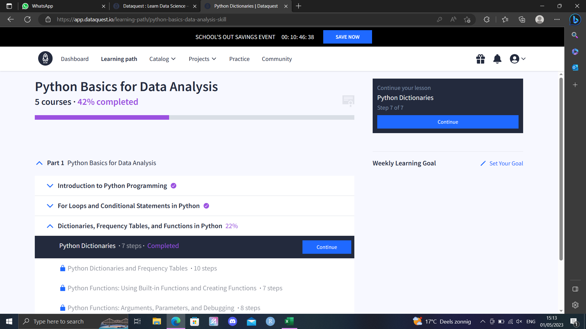
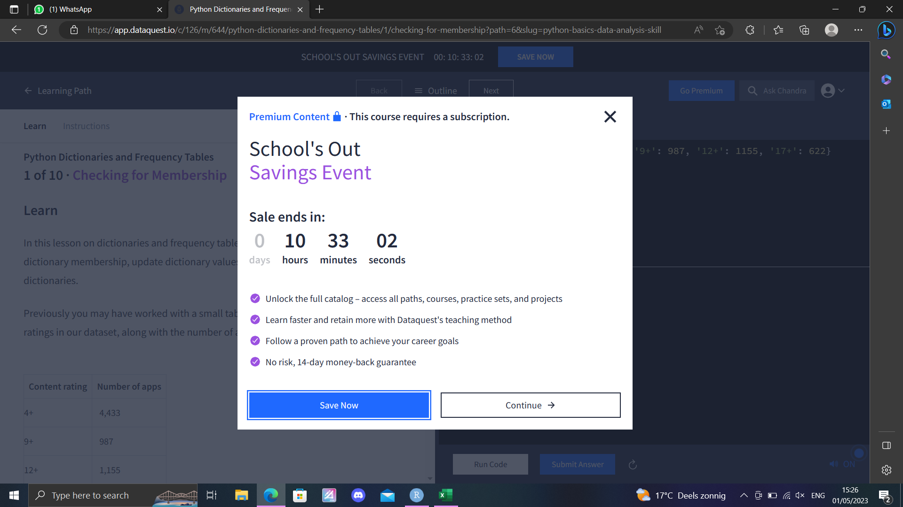

# free studying period

I have taken a course data science during the minor of my study. One of our assignments was to set our own learning goals for skills we want to obtain in the future. During my minor, I spend about 40 hours on getting started with learning these new skills. The aim was to get started, and to lay a foundation on which I could build further after I graduated.  On this page, I will describe what I choose to do with this free learning period and how I spend my time on it. 

I got started by asking myself what I wanted to do and Where I wanted to be in ~2 years time. 

It was during this time that I realized I still have multiple things I want to learn and develop myself in within the life science field. These include:

- working in an ecological lab 
- clinical lab work (like laboratory work in a hospital)
- working in a project with organoids

Aside from these goals within the life science field, I also still had many personal goals. However, because these do not relate to this portfolio I did not add them here. But, it did rather quickly become clear to me that there is still a lot that I want to learn and do.This made it difficult for me to set my sight on a specific goal. Especially as I'm not certain if I still want to continue working in the field of bioinformatics and data science in the future. Therefor, I decided to take a more general approach and get a wider few of what's all still possible for me  with bioinformatics. This would help me to more easily adept, and learn specific skills later when I've a more clear vision of what I want to do. 

To generally widen my view, I decided to learn python. This would be useful to more easily flow into jobs where python is a required programming language. Further more, python is a very useful language for software creation, which I would like to learn, to create my own software at some point in the future. This latter use is not necessarily needed for my job within life sciences, but, certainly could be an useful skill to obtain nevertheless.

At the time I decided I wanted to learn how to program in python, I had no experience or knowledge of how to do so. Therefor, I had to start learning this new language from scratch, and start at the basics. 

## planning and organisation to learn python 

When trying to learn a new skill, a proper plan makes the learning process more structured and helps to see if your goals are achieved. In this free period I want to take the time to learn basic python from online tutorials on YouTube videos, and after that use this knowledge to create some own scripts, and to learn some basic machine learning. furthermore, I will try to use some different code editors. My general plan is: 

- as I progress I will describing my learning process on this page and show what I learned (5 hours)

- get to know the basics by following  an online class to learn python (20 hours)

- clear up any difficulties that I do not understand by: 
  - watching YouTube tutorials 
  - reading through some example python scripts and trying to recreate my own
  - go on Reddit and read through existing posts or create my own 

- machine learning in python (15 hours)
  - watch YouTube tutorials, and write along with the videos to recreate the tutorial scripts 
  - apply the gained skills to create my own scripts from scratch and apply them to a dataset 
  
- getting familiar with other code editors (5 hours): 
  - pychar 
  - Jupyter Notebook
  - Visual Studio Code
  
All python scripts I created can be found [here](https://github.com/Arthur1Timmermans/portofolio/tree/main/python%20scripts)
All jupyter notebook files that I created can be found [here](https://github.com/Arthur1Timmermans/portofolio/tree/main/python%20scripts/jupyter_notebook)
  
## online python course 

I tried to learn the basics of python by following along with [this](https://www.dataquest.io/path/python-basics-for-data-analysis/) online python course for beginners. However, after finishing 42% of the course I got stuck behind a pay wall, which I did not realize existed when I started the course. 

This course had to be payed with a credit card, which I do not have. Therefor, I could not finish the course. The skills I eventually practiced included: 

- variables
- python data types 
- lists
- if statements 
- for loops 

Furthermore, I wrote a python script in jupyter notebook to analyze the "prison break" [data set](https://en.wikipedia.org/wiki/List_of_helicopter_prison_escapes). This data set is a classic which is mentioned a lot in various python tutorials. The data set contains information about the amount of prison break attempts with helicopters.

## more basics 

I did not want to start another 20 hour course (free), as this would simply take away to much of the time I had available to spend on this small project. Therefor, I watched  [this youtube video](https://www.youtube.com/watch?v=kqtD5dpn9C8). in this video, I learned the following things: 

- Variables
- Receiving Input
- Type Conversion
- Strings
- Arithmetic Operators 
- Operator Precedence 
- Comparison Operators 
- Logical Operators
- If Statements
- While Loops
- Lists
- List Methods
- For Loops
- The range() Function 
- Tuples

This video went over quite a few basic things that I also learned in the (41%) course that I took. As I listened and watched the video, I came to realized that there are quite some similarities between python and r. I went on to practice with python, and made some basic python scripts, like: 

- a basic calculator 
- rock-paper-scissors game 
- password generator 
- a timer which can remind me to get up while coding 

## machine learning

As I was learning the basics of python, I got more interested in machine learning and the possibilities that machine learning brings with it. Therefor, I watched [this youtube video](https://www.youtube.com/watch?v=7eh4d6sabA0&t=1586s) to learn more about machine learning (rather interesting I learn how to make a machine learn, ain't it?). 

I got familiar with some of the most famous python machine learning libraries, including: 

- numpy 
- pandas 
- matplotlib
- scikit-learning 

I got started with machine learning in pycharm, as this also the environment where I got started with learning python. However, the constant data inspection was rather messy and difficult in the terminal. Therefor, I rather quickly switched to using Jupyter notebook, as frequent data inspection is far easier in this program. The first form of machine learning I practiced with, was with a decision tree algorithm. This is an algorithm that is rather easy to understand and use. 

I used a decision tree algorithm to determine which drug patients received based on their Age, sex, blood pressure, Cholesterol, and Na_to_K. This is a rather simple method, that falls apart when using bigger more complex data sets. However, it is still sufficient to get some basic understandings. The results of this are shown in the jupyter notebook file located in the github directory of this portfolio. 

To further test my skills in importing, visualizing and analyzing data in python I analyzed my own YouTube watch history in another jupyter notebook file. Afterwards I tried to use a machine learning algorithm to analyze and estimate my watching behavior. This notebook can also be found in the github directory of this portfolio. 

### neuro networks
A rather famous kind of machine learning that I've heard a lot about are neuro networks. I did not understand how they worked, and therefor, I watched these videos: 

- [what is a neuronetwork?](https://www.youtube.com/watch?v=aircAruvnKk)
- [how neuronetworks learn](https://www.youtube.com/watch?v=IHZwWFHWa-w)
- [what does backpropagation do?](https://www.youtube.com/watch?v=Ilg3gGewQ5U)
- [Backpropagation calculus](https://www.youtube.com/watch?v=tIeHLnjs5U8)

In these videos, the creator really inspired me and suggested me to check out [this book](http://neuralnetworksanddeeplearning.com/) by Michael Nielsen introducing neural networks and deep learning. In this book, neuro networks get explained in more depth and an example with code is given. A neuro network was trained to recognize hand written digits with 96% accuracy.All code and data was open source and accessible from [this github page](https://github.com/mnielsen/neural-networks-and-deep-learning.git).I also tried to type along to recreate the network. However, for this I was to inexperienced and the network did not work. Therefor, I did not include that into this repository. However, I will still continue to read this book in the future to get a proper understanding of neuronetworks and to get a better hang of it. 

## code editors 

Throughout the last year, I have for the most part used Rstudio, which has worked well for me so far. However, while learning python, I have seen people using many different code editors. And to further widen my few on what is all possible, I decided to try a few other code editors myself. Down bellow I describe which code editors I used and what my overall experience with them was. 

### pycharm 

I got started with learning python in [PyCharm](https://www.jetbrains.com/pycharm/download/?source=google&medium=cpc&campaign=14124132615&term=pycharm&gclid=Cj0KCQjworiXBhDJARIsAMuzAuyFYmcw1j7wk22Vc3ccWgCg3uEsjcXW6GtrGBkBHeJpcqd89tuKHOsaAjQpEALw_wcB#section=windows). This is an Integrated Development Environment (IDE). My overall experience with Pycharm was very positive. In Pycharm it is easy to create and manage projects and the build in vision control mechanisms work well. It is also possible to integrate git into pycharm. Further more The code editing is easy with good auto-indentation. The ease of use helped me to get comfortable with Python quickly. There are also many more advances options, and many customization options with packages, which makes this a great code editor for both new and experienced data annalists. A downside of Pycharm is that that the  professional version with all features needs to be purchased. This makes this program less suitable within the idea of "reproducible research" and "open science". Therefor, I decided to look for another (free) code editor or IDE.  

### visual studio code 

soon after getting started with watching python tutorials, I saw people using Visual Studio Code (VSC). This is an open-source text editor, and by far the most used code editor. Because this code editor is open-source, it is more suitable for reproducible research and open science. There are also many packages available due to the wide spread use of VSC. I noticed that, compared to pycharm, VSC is a more light weight code editor, that is easier on the computer but offers less processing power in return. The overall inter phase was easy to work with and offered a lot of customization. There is also a git plug in available, to add version control. This made VSC a pleasant code editor to work with and a great alternative to rstudio (while primarily working with python). 

### jupyter notebook 

I started working with jupyter notebook while learning some basics about machine learning. The main benefit of jupyter notebook is that, all results will be stored under the code chunks. These results will be saved and maintained until the code chunk is ran again. Therefor, code chunks only need to be run once and looking back at results becomes far easier. This makes it much easier to make small changes based upon earlier results. And further more, it felt convenient that unlike in R, where the data in the terminal disappears each time the r session is terminated, the data in jupyter notebook was maintained. Just like R studio and Visual studio code, jupyter notebook is free and helps the movement towards open science. 

### obsidian 

I came across obsidian while watching [this youtube video](https://www.youtube.com/watch?v=cBzc5r-FNW0&t=9s) in my spare time. Obsidian allows to edit R markdown documents and create networks between markdown files. Because I mainly focused on python In this period, I didn't go to much in depth into how obsidian works. But it seems like a program I'd still want to try in the future. 

## conclusion 
As I worked with python in various different types of code editors, and than switched back to R studio to write this markdown file, I noticed how quickly I had grown unfamiliar with rstudio and that I started to confuse shortcuts and features from other programs. This showed me that, even though switching between different langues and programs may be relatively easy, it also has high value to be well familiar with the tools you use. Therefor, my entire idea to widen my few and get to know a bid about everything, might was not correct. 

For now I will stick to using R in R studio, and writing python in VSC. If in the future  I Need to learn different programming languages, or get familiar with new code editors, I will make the switch when it is necessary.  

The time I spend into this project did help me to get started with learning python, I have been able use what I have learned to write my own scripts, and I already have some ideas of how I can continue with learning python in the future. Therefor, in my opinion I did finish this project properly. 

