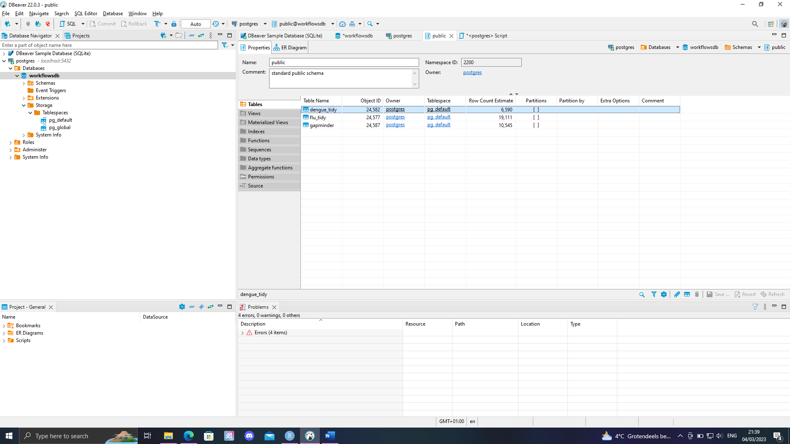
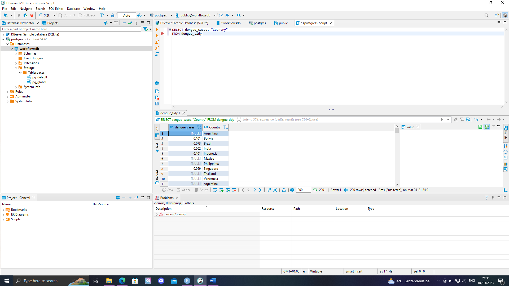
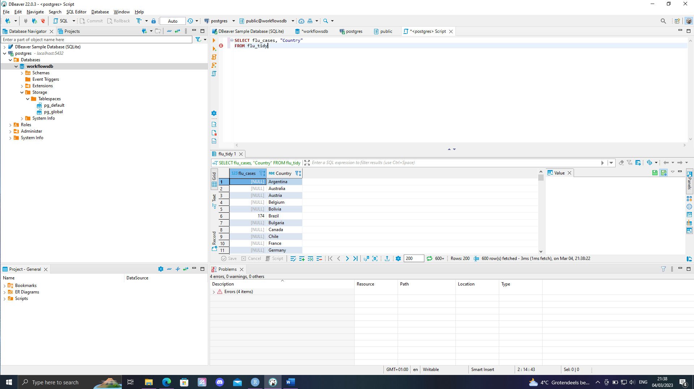
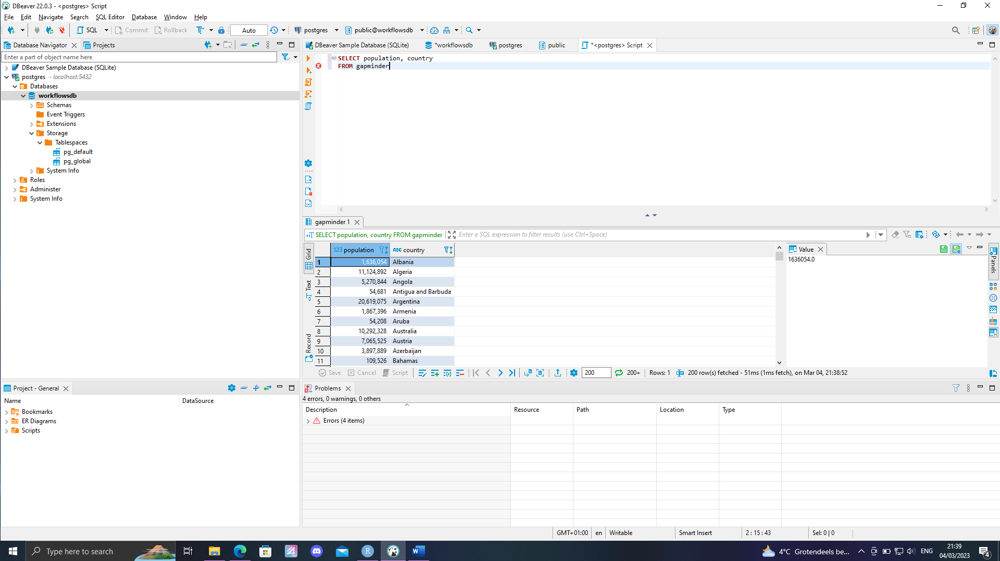

# Structured Query Language

Structured Query Language (SQL), is a programming language which was creating for communicating with and editing databases. With the increasing usage of cloud storage and databases, the importance of SQL has become higher as the world got more automated. nearly all databases use SQL as their main programming language. Because of the high usage, learning SQL is very relevant. I currently have a basic knowledge of how to use SQL to create a database and to  add, edit and remove data from databases.  On this page, I will demonstrate what I can all do with SQL and build a SQL database. For this, I used two files that contained the number of dengue fever cases and flu cases from 2002 till 2015. Further more, some additional information about the countries was obtained from the gap minder data set, which is available as a R-package. I will make a short analysis of the data sets, in which the research aim is: 

- to show the spread of flu and dengue fever and to test if there is any correlation between the spread of flu and dengue fever 

My hypothesis is that, because flu and dengue fever are different types of virusses, the spread will not be related. 

The general steps I took in this analysis are: 

- Manual download of the Dengue Fever data set from the [dsfb2 repository](https://github.com/DataScienceILC/tlsc-dsfb26v-20_workflows)

- Manual download of the Flu Fever data set from the [dsfb2 repository](https://github.com/DataScienceILC/tlsc-dsfb26v-20_workflows).

- install the "gapminder" r-package 

- Clean and tidy the data

- Write the data away in the folder data

- Make a SQL database of the data using RPostgreSQL

- join the different data tables in the database 

- download the joined table from the database 

- Visualize the data in graphs 

- if a correlation is suspected, perform descriptive statistics 

- Conclusion

## cleaning data 

After loading in the data, I inspected the data. The data from the gap minder data set is shown in table \@ref(fig:07table1)

The data from the dengue data set is shown in table \@ref(fig:07table2)

The data from the flu data set is shown in table \@ref(fig:07table3)


```{r setup7, warning = FALSE, message = FALSE, echo = FALSE} 
library(RPostgreSQL)
library(gapminder)
library(tidyverse)
library(RPostgres)
library(gridExtra)
library(ggplot2)
library(ggtext)
library(plotly)
library(dslabs)
library(here)
library(DBI)
library(DT)
library(data.table)
```

```{r 07 reading in data, warning = FALSE, message = FALSE, echo = FALSE}
dengue <- read.csv(here::here("raw/007_dengue.csv"), skip = 11) #skip 11 is to ignore the meta data at the top

flu <- read.csv(here::here("raw/007_flu.csv"), skip = 11) #skip 11 is to ignore the meta data at the top

gapminder <- read_builtin("gapminder") # load in gap minder data set
```

```{r 07table1,include=TRUE, warning = FALSE, message = FALSE, echo = FALSE, fig.cap= "data from gap minder dataset"}
datatable(gapminder) # show data in data table

```

```{r 07table2, include=TRUE, warning = FALSE, message = FALSE, echo = FALSE, fig.cap= "data from dengue dataset"}
datatable(dengue) # show data in data table

```

```{r 07table3, include=TRUE, warning = FALSE, message = FALSE, echo = FALSE, fig.cap= "data from flu dataset"}

datatable(flu) # show data in data table
```

The gap minder data set was already in tidy data format, and therefor did not need to be edited. The dengue and flu data set did require editing to make the tables tidy. To make later comparisons of the different data sets easier, the format of the flu and dengue data sets were changed to match the format of the gap minder data set. The changes made were: 

- Put all countries in one column, and the cases to one column
- split the column Date to three columns named Year, Month and Day 
- correct data classes 
- remove "na" data 

The new tidy dengue table is shown in table \@ref(fig:07table4)
The new tidy flu table is shown in table \@ref(fig:07table5)

The new tables were stored as a .csv file and as a .rds file in the "[data folder](https://github.com/Arthur1Timmermans/portofolio/tree/main/data)"

```{r 07 tidy data, echo=FALSE, message=FALSE, warning=FALSE}
# tidy the dengue dataset
## Put all countries in one column, and the cases to one column
dengue_tidy <- dengue %>%  pivot_longer(
                                        cols = Argentina:Venezuela, 
                                        names_to = "Country", 
                                        values_to = "dengue_cases" 
                                        )

# split the column Date to three columns named Year, Month and Day
dengue_tidy <- dengue_tidy %>% separate(Date, c("Year", "Month", "Day"))

# correct data classes
dengue_tidy$Year <- as.numeric(dengue_tidy$Year)
dengue_tidy$Month <- as.numeric(dengue_tidy$Month)
dengue_tidy$Day <- as.numeric(dengue_tidy$Day)

#remove "." from data and correct data class back to numeric 
dengue_tidy$dengue_cases <- as.numeric(gsub('[^[:alnum:] ]','',dengue_tidy$dengue_cases))

# remove data with na for later analysis 
dengue_tidy <- na.omit(dengue_tidy)


# tidy the flu dataset
## Put all countries in one column and the cases in another column
flu_tidy <- flu %>% pivot_longer(
                                cols = Argentina:Uruguay,
                                names_to = "Country",
                                values_to = "flu_cases"
                                )

## split the column Date to three columns named Year, Month and Day
flu_tidy <- flu_tidy %>% separate(Date, c("Year", "Month", "Day"))

## correct data classes
flu_tidy$Year <- as.numeric(flu_tidy$Year)
flu_tidy$Month <- as.numeric(flu_tidy$Month)
flu_tidy$Day <- as.numeric(flu_tidy$Day)

# remove data with na for later analysis 
flu_tidy <- na.omit(flu_tidy)
```

```{r 07table4, include=TRUE, warning = FALSE, message = FALSE, echo = FALSE, fig.cap= "tidy data from dengue dataset"}
datatable(dengue_tidy) # show data in data table
```

```{r 07table5, include=TRUE, warning = FALSE, message = FALSE, echo = FALSE, fig.cap= "tidy data from flu dataset"}
datatable(flu_tidy) # show data in data table
```


```{r 07 saving in the desired formats, warning=FALSE, message=FALSE, echo=FALSE}

#all data gets saved to the data folder in a csv file
flu_tidy %>% write.csv(file = "./data/flu_tidy.csv")
dengue_tidy %>% write.csv(file = "./data/dengue_tidy.csv")
gapminder %>% write.csv(file = "./data/gapminder.csv")

# all data also gets saved to the data folder in a RDS file
saveRDS(gapminder, file = "./data/gapminder.rds")
saveRDS(dengue_tidy, file = "./data/dengue_tidy.rds")
saveRDS(flu_tidy, file = "./data/flu_tidy.rds")
```

## setting up a database 

### exporting data to DBeaver

The program "[DBeaver](https://dbeaver.io/)" was used to set up and maintain a database for this project. The new tidy data files were exporting to DBeaver using Rpostgres. This is further shown in the code chunk bellow. 

```{r 07 export data to DBeaver, eval=FALSE, echo=TRUE, warning=FALSE, message=FALSE}
# the link to exporting files to DBeaver requires to fill in personal information such as a  password, which is unique for all users. 
# this analysis is reproducible if you copy the code and insert your own local information. 

con <- dbConnect(RPostgres::Postgres(),
                 dbname = "workflowsdb",
                 host = "localhost",
                 port = "5432",
                 user = "postgres",
                 password = "fill in your own password")
dbWriteTable(con, "flu_tidy", flu_tidy)
dbWriteTable(con, "dengue_tidy", dengue_tidy)
dbWriteTable(con, "gapminder", gapminder)

dbListTables(con)

dbDisconnect(con)

```

After checking both in R using the "dbListTables(con)" function, and in DBeaver, it was confirmed that the data was imported properly. This can also be seen in the image bellow. 




### SQL script 
In DBeaver, the following script is written to further inspect the data. All used SQL scripts can also be found [here](https://github.com/Arthur1Timmermans/portofolio/tree/main/SQL%20scripts). 

---------------------------------------------------------------------------------------------------------------------
SELECT dengue_cases, country 
FROM dengue_tidy order 
BY dengue_cases asc

SELECT flu_cases, country 
FROM flu_tidy order 
BY flu_cases asc

SELECT population, country 
FROM gapminder order 
BY population desc
---------------------------------------------------------------------------------------------------------------------

The images bellow further show the data loaded into DBeaver: 








After inspected the data in DBeaver, the data was also still inspected in R using the dplyr package. Bellow the data from the dengue, flu and gap minder data set are shown respectively. It becomes visible that, the data in these tables are the same as the data that was loaded into DBeaver. This confirms that the data was exported properly. 

```{r 07 visualizing  data sets with dplyr, include=TRUE, warning = FALSE, message = FALSE, echo = FALSE}
dplyr::tbl_df(dengue_tidy)

dplyr::tbl_df(flu_tidy)

dplyr::tbl_df(gapminder)
```

The file from the gap minder data set still contained a lot of additional information from additional years, that was not included in the flu and dengue fever data set. Therefor, table \@ref(fig:07table6) was created. In this table only the years 2002 - 2015 were selected. This new tidy data file from the gap minder data set was also exported to DBeaver using Rpostgres. 

```{r 07 creating tidy gapminder table,  warning=FALSE, message=FALSE, echo=FALSE}
gapminder_tidy <- gapminder[between(gapminder$year, 2002, 2015), ] #filter the years of the flu/dengue fever data set 

gapminder_tidy <- gapminder_tidy %>% select(year, country, infant_mortality:region) # change the order to year, country. This is the same order as in the flu/dengue fever data set 

```

```{r 07 export data to DBeaver 2, eval=FALSE, echo=FALSE, warning=FALSE, message=FALSE}
dbWriteTable(con, "gapminder_tidy", gapminder_tidy) # exporting the new gapminder table to DBeaver. 
```

```{r 07table6, include=TRUE, warning = FALSE, message = FALSE, echo = FALSE, fig.cap= "tidy data from gapminder dataset"}
datatable(gapminder_tidy)
``` 
 
### edditing data in DBeaver 

The flu and dengue fever data sets were joined together in DBeaver using SQL. All used SQL scripts can be found [here](https://github.com/Arthur1Timmermans/portofolio/tree/main/SQL%20scripts). In total, three new tables were created: 

- dengue_gapminder: this table combines the dengue fever cases with additional information from the gap minder r package 

- flu_gapminder: this table combines the flu cases with additional information from the gap minder r package 

- flu_dengue: this table combines the flu and gap minder cases 


### importing data from DBeaver 

after exporting the data from Rstudio to DBeaver, the data was imported back from DBeaver to Rstudio with the following script: 

```{r 07 import data from dbeaver, eval=FALSE, echo=TRUE}
# import the data into R after inspecting the data in DBeaver
dengue_gapminder <- dbReadTable(con, "dengue_gapminder")
flu_gapminder <- dbReadTable(con, "flu_gapminder")
flu_dengue <- dbReadTable(con, "flu_dengue")
```

```{r 07 saving imported data, warning=FALSE, message=FALSE, echo=FALSE, eval=FALSE}

#all imported files from dbeaver get saved as a csv file. Now the code for exporting/importing to DBeaver does not need to run for the further analysis. 

flu_gapminder %>% write.csv(file = "./data/flu_gapminder.csv")
dengue_gapminder %>% write.csv(file = "./data/dengue_gapminder.csv")
flu_dengue %>% write.csv(file = "./data/flu_dengue.csv")

```

```{r 07 reading in cvs files with import data from DBeaver, warning=FALSE, message=FALSE, echo=FALSE}

#loading in the previously saved csv files with data from DBeaver  

flu_gapminder <- read.csv("data/flu_gapminder.csv")
flu_dengue <- read.csv("data/flu_dengue.csv")
dengue_gapminder <- read.csv("data/dengue_gapminder.csv")

# selecting needed columns 
flu_gapminder <- flu_gapminder %>% select(Country:region)
flu_dengue <- flu_dengue %>% select(Country:flu_cases)
dengue_gapminder <- dengue_gapminder %>% select(Country:region)

# setting N.A to 0 for further analysis 
flu_gapminder <- replace(flu_gapminder, is.na(flu_gapminder), 0)
flu_dengue <- replace(flu_dengue, is.na(flu_dengue), 0)
dengue_gapminder <- replace(dengue_gapminder, is.na(dengue_gapminder), 0)
```

## data visualization 
The data will now be visualized to check if the flu or dengue fever is more prevalent in certain areas.

### flu data set 


The data from the flu data set is shown in figure \@ref(fig:07graph1). In this graph, for each country the amount of flu cases is shown on the Y axis and the years are shown on the X axis.A rather wide geological spread of data is visible, and reading accurate flu cases from this table is rather difficult. Therefor, the data is further summarized in table \@ref(fig:07table7). In this data table the flu and gap minder data set are joined.

When considering the number of **flu** cases globally as shown in figure \@ref(fig:07graph1) and table \@ref(fig:07table7), it becomes visible that the highest occurrence of the flu is in South Africa, followed by Canada and the United States. To slightly less extend also countries like  Mexico, Germany and Romania. The lowest flu occurrences on the other hand are found in Sweden, followed by Chile and New Zealand.

It becomes visible that there is no clear link between the amount of flu cases and the: 

- infant mortality 
- life expectancy 
- fertility 
- gdp 

further more, the geological spread is also rather wide. A general trend that does appear to be visible is that: 

South Africa has by far the most amount of flu cases, however, this is a continent with a very large population and therefor directly comparing the amount of flu cases between south Africa and other far smaller countries/continents would not statistically relevant. To properly compare the difference the amount of flu cases should be expressed as a fraction of the population. However, due to missing data about the population size in new Zealand, south Africa and The united states, this is currently not possible. 

Canada, the United States and Mexico appear to have far larger flu numbers than European countries. This could Possibly be explained by the difference in healthcare system, better vaccination rates, or climate in general. However, not enough meta data is available to concretely establish this hypothesis, and the collection and analysis of all this data falls beyond the scope of this research report. 

All in all, among most countries, the amount of flu cases does not appear to rise overall. After one or a few years with more flu cases, the amount of flu cases the next years appear to drop. The development of the global flu cases, and the specific kinds of flu that are currently present, will remain an important statistic to keep track of to keep flu vaccinations up to date for people with weakened immune systems. However, for people without a weakened immune system the amount of global flu cases does not appear to be concerning currently. 


```{r 07graph1, message=FALSE, warning=FALSE, echo=FALSE, fig.cap= "first graph from flu dataset, sorted by country"}
#clean variables names
flu_tidy <- janitor::clean_names(flu_tidy)

flu_1 <- flu_tidy %>% group_by(year) %>% na.omit() %>% 
  ggplot(aes(x = year,
             y = flu_cases,
             fill = year)) +
  geom_col() +
  theme(axis.text.x = element_text(angle = 90))+
  labs(title = "Evaluating the number of flu cases",
       subtitle = "Have flu cases risen over the years?",
       x = "Year",
       y = "Number of flu cases",
       caption = "Data source: Course instructors") 


## Check per country
flu_1 + facet_wrap(~country)
```


```{r 07table7,  warning=FALSE, message=FALSE, echo=FALSE, fig.cap= "data table summarizing flu dataset"}

summary_flu <- aggregate(flu_gapminder %>% select(flu_cases:gdp), list(flu_gapminder$Country), FUN=mean)

fraction_flu <- 100/summary_flu$population*summary_flu$flu_cases

summary_flu$fraction_flu <- fraction_flu

datatable(summary_flu)
```

The percentage of the number of flu cases when compared to the population is expressed in figure \@ref(fig:07graph2). In this graph, the summarized average flu cases of each country is shown in the left. The percentage of the population is shown in the right graph. This graph shows a different spread, with countries with relatively low population sizes having a relatively higher percentage of flu cases, while countries with larger populations have a relatively speaking lower percentage of flu cases. 

```{r 07graph2, warning=FALSE, message=FALSE, echo=FALSE, fig.cap= "joined graph from summary flu dataset, sorted by country"}
# making graph with average flu cases 
graph_summary_flu1 <- summary_flu %>% ggplot(aes(x = Group.1, 
                           y = flu_cases)) +
  geom_col() +
  theme(axis.text.x = element_text(angle = 90))+
  labs(title = "Evaluating the average number of flu cases",
       x = "country",
       y = "average Number of flu cases",
       caption = "Data source: Course instructors")

# making graph with flu % 
graph_summary_flu2 <- summary_flu %>% ggplot(aes(x = Group.1, 
                           y = fraction_flu)) +
  geom_col() +
  theme(axis.text.x = element_text(angle = 90))+
  labs(title = "Evaluating the average number of flu cases",
       x = "country",
       y = "average Number of flu cases",
       caption = "Data source: Course instructors")
                       
                       
grid.arrange(graph_summary_flu1, graph_summary_flu2, nrow = 1)                       
```


### dengue fever data set 

The data from the dengue fever data set is shown in figure \@ref(fig:07graph3). This data has also been summarized in table \@ref(fig:07table8), where the gap minder data set is joined to get some additional back ground information about the countries. 

When looking at figure \@ref(fig:07graph3), it's visible that the highest number of **dengue** cases are seen in Venezuela, followed by Thailand and Singapore. While the lowest cases are seen in Bolivia, Argentina and India. Further more in table \@ref(fig:07table8) the percentage of dengue cases of the entire population of the country is calculated. This shows a different spread, with Singapore, Venezuela, and Bolivia having the highest Percentage of cases. While India, Indonesia and Brazil have the lowest number of dengue fever cases. India and Indonesia have relatively speaking very large population, and this could explain why the over all percentage of the population that gets dengue fever is so low. 

Dengue fever develops after infection with the Flaviviridae virus carried by mosquitoes. These mosquitoes are more prevalent in countries with warmer climates, which might explain the spread of occurrences that is visible within figure \@ref(fig:07graph3)

There does not appear to be a clear link between the dengue cases and the:  

- infant mortality 
- life expectancy 
- fertility 
- gdp 

```{r 07graph3, message=FALSE, warning=FALSE, echo=FALSE, fig.cap= "first graph from dengue dataset, sorted by country"}
#clean variables names
dengue_tidy <- janitor::clean_names(dengue_tidy)

dengue_1 <- dengue_tidy %>% group_by(year) %>% na.omit() %>% 
  ggplot(aes(x = year,
             y = dengue_cases,
             fill = year)) +
  geom_col() +
  theme(axis.text.x = element_text(angle = 90))+
  labs(title = "Evaluating the number of dengue fever cases",
       subtitle = "Have the number of dengue fever cases risen over the years?",
       x = "Year",
       y = "Number of flu cases",
       caption = "Data source: Course instructors")

## let's see the difference between countries
dengue_1 + facet_grid(~country)
```


```{r 07table8,  warning=FALSE, message=FALSE, echo=FALSE, fig.cap= "data table summarizing data from the dengue fever data set"}

summary_dengue <- aggregate(dengue_gapminder %>% select(dengue_cases:gdp), list(dengue_gapminder$Country), FUN=mean)

fraction_dengue <- 100/summary_dengue$population*summary_dengue$dengue_cases

summary_dengue$fraction_dengue <- fraction_dengue

datatable(summary_dengue)
```


## joining graphs 
To be able to better compare the two occurrences of flu and dengue fever, the 2 plots will be joined together as is shown in figure \@ref(fig:07graph4). However, this comparison is not properly possible as the only country in which both flu and dengue cases have been reported is Argentina. To be able to better compare flu and dengue fever, more data would be needed. But no strong correlation between mosquito and dengue fever is suspected, as flu is an airborne disease, and dengue fever is a disease transmitted by a mosquito species. 

```{r 07 join, message=FALSE, warning=FALSE, echo=FALSE}
flu_dengue <- full_join(flu_tidy, 
                        dengue_tidy, 
                        by = c("country", "year"), 
                        suffix = c("_flu", "_dengue"))

## let's also join the data from the gapminder dataset with the flu and dengue dataset
gapminder_flu_dengue <- inner_join(flu_dengue, 
                                   gapminder, 
                                   by = c("country", 
                                          "year"))

```


```{r 07 Visualize the cases of flu per country, message=FALSE, warning=FALSE, echo=FALSE}
# plot occurrences of flu and dengue per region
flu_country <- gapminder_flu_dengue %>% 
              ggplot() + 
              geom_col(aes(x = country, 
                           y = flu_cases,
                           fill = country)) +
  theme_minimal()  +
  #turn the x axis labels by a 90 degree angle
  theme(axis.text.x = element_text(angle = 90, 
                                   hjust = 1),
        #legend is unnecessary
        legend.position = "none"
        ) + 
  #Explain the graph
  labs(title = "Flu cases per country", 
       x = "",
       y = "Flu cases")

```


```{r 07 Visualize the cases of dengue fever per country, message=FALSE, warning=FALSE, echo=FALSE}
dengue_country <- gapminder_flu_dengue %>% 
                  ggplot() + 
                  geom_col(aes(x = country, 
                               y = dengue_cases,
                               fill = country)) +
                  theme_bw() +
  
                  #turn the x axis label 90 degrees
                  theme(axis.text.x = element_text(angle = 90, 
                                     hjust = 1),
                        legend.position = "none") + 
  
                  #explain the graph
                  labs(title = "Cases of Dengue Fever per country", 
                       x = "",
                       y = "Cases of Dengue Fever")
```

```{r 07graph4, message=FALSE, warning=FALSE, full.width=TRUE, echo=FALSE, fig.cap="flu and dengue fever graphs joined together"}
grid.arrange(flu_country, dengue_country, nrow = 1)
```


