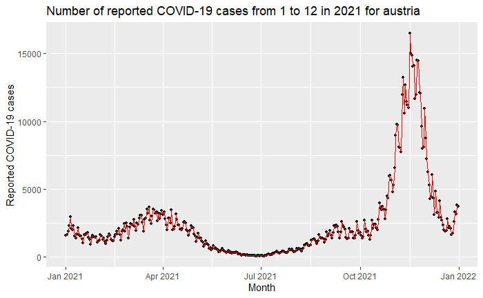
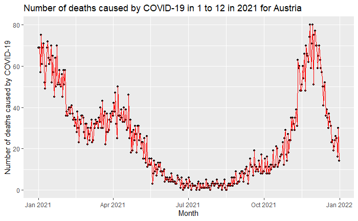
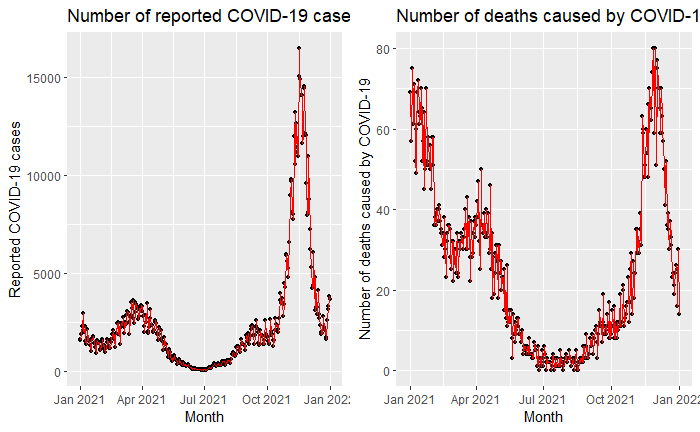

# parameterization
```{r setup9, echo=FALSE, warning = FALSE, message = FALSE}
knitr::opts_chunk$set(warning = FALSE, message = FALSE, echo = FALSE)
library(tidyverse) 
library(here)
library(ggplot2)
library(dplyr)
library(cowplot)
```

```{r 09 loading data, echo=FALSE, warning = FALSE, message = FALSE}
#loading in data into object 
covidT9 <- read.csv(here::here("raw", "data_covid19_cases.csv"))
```

```{r 09 setting params, echo=FALSE, warning=FALSE, message=FALSE}
#divining the params 
covidT9 <- covidT9 %>% 
  dplyr::filter(countriesAndTerritories == params$country, 
                year == params$year, 
                month >= params$period_start, 
                month <= params$period_end) 

# change the class type of dateRep to numeric by classifying it as a date
covidT9$dateRep <- as.Date(covidT9$dateRep, format = "%d/%m/%Y")
```
parameterization is a good way to make code more robust and flexible. Furthermore, it also makes it easier for other people to change each other their codes without the risk of adding inconsistencies. In this chapter, I will make a paramererized report of  the European Center for Disease Control (ECDC) COVID-19 case data. This data is available at [the ECDC website](https://www.ecdc.europa.eu/en/publications-data/data-daily-new-cases-covid-19-eueea-country). The aim of this analysis is to create 3 graphs, in which the amount of infections (new cases) and deaths will be mapped by the following params: 

- The country to which the report applies to

- The year that the reported data applies to

- The period in months that the report applies to

At first, I mapped the new cases, which can be seen in plot 1. In this plot, it is visible that by far the largest peak in covid19 cases is measured between October and December in 2021. This would correspond with the flu/cold season.

```{r 09 cases plot, eval=FALSE, include=TRUE, warning=FALSE, message=FALSE}
# plot the number of reported COVID-19 cases in the year 2020
cases <- covidT9 %>%
  ggplot(aes(x = dateRep, y = cases)) +
  geom_point(size = 1) +
  geom_line(aes(color = "red")) +
  labs(title = paste("Number of reported \n COVID-19 cases from", params$period_start, "to", params$period_end, "in", params$year, "for", params$country),
       x = "Month",
       y = "Reported COVID-19 cases")
  
cases
```


up next, I mapped the deaths caused by covid19. The results of this, can be seen in plot 2. Within this plot, a line somewhat similar to the covid19 cases (plot 1) can be seen. To further visualize this, plot 1 and 2 are also combined using the plot_grind function. This created plot 3, in which a clear connection between the 2 plots can be seen. 

```{r 09 deaths, message=FALSE, warning=FALSE, eval=FALSE, include=TRUE}
# plot the number of deaths by COVID-19 in the year 2020
deaths <- covidT9 %>%
  ggplot(aes(x = dateRep, y = deaths)) +
  geom_point(size = 1) +
  geom_line(color = "red") +
  labs(title = paste("Number of deaths caused \n by COVID-19 in", params$period_start, "to", params$period_end, "in", params$year, "for", params$country),
       x = "Month",
       y = "Number of deaths caused by COVID-19")
  
deaths
```

```{r 09 combine, eval=FALSE, include=TRUE, warning=FALSE, message=FALSE}
# combine the 2 previously made plots in 1 image with the plot grind function 
plot_grid(cases, deaths,
          label_size = 8)
```

