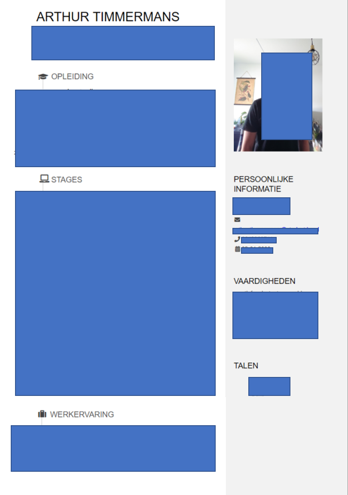

# prerequisites 
Welcome to my personal portfolio. On this website I will give more inside into what my skills are and  which projects I work(ed) on. I am a life science student at the Hoge School Utrecht (HU), and will graduate in 2023 as a lab technician. 

Within the science field, not just for data analysis's, but also for science in a whole, I strongly believe in the movement towards open science. In my personal opinion, being open about our research and sharing our knowledge and experience will help to reunite people. And when we work together, feats that seem impossible right now suddenly become achievable. While making this website, I worked in a github repository in RMD files. To see the underlying code of my website, you can visit my github [reposetory](https://github.com/Arthur1Timmermans/portofolio.git). Make sure to read the "readme" on the home page for further instructions on how to use my github repository. 

For those who are interested in getting more underlying information about me, I creating a resume with R and this is shown bellow. This resume was build using a template from the "pagedown" package. The RMD file that I used to create my resume can be found [here](https://github.com/Arthur1Timmermans/portofolio/blob/main/rmd/cv.Rmd). This file was also knitted to a [html file](https://github.com/Arthur1Timmermans/portofolio/blob/main/html/cv.html) and an [image](https://github.com/Arthur1Timmermans/portofolio/blob/main/images/cv.png) 

